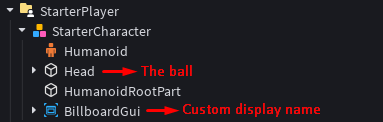

# Ball

### Overview

Custom character for each player and give it physics based movement that controlled by default player movement input
<br><br>

### Architecture


<br><br>

### Ball movement

To make the ball moving according to player's input, we need to get the humanoid's move direction
```lua
local moveDir = humanoid.MoveDirection
```

Manipulate the value for each axis
```lua
moveDir = Vector3.new(moveDir.Z, 0, -moveDir.X) --my case
```

### Multiply the move direction and apply it to our ball
```lua
ball:ApplyAngularImpulse(moveDir * force)
```

(Optional) add some resistor so it will slow down fast
```lua
ball:ApplyAngularImpulse(-ball.AssemblyAngularVelocity / 2)
```
<br>

### Usage
```lua
local runService = game:GetService("RunService")
local replicatedStorage = game:GetService("ReplicatedStorage")
local uis = game:GetService("UserInputService")
	
local player = game.Players.LocalPlayer
local camera = workspace.CurrentCamera
	
local char = player.Character or player.CharacterAdded:Wait()
local ball: Part = char:WaitForChild("Head", math.huge)
local humanoid = char:WaitForChild("Humanoid", math.huge)
	
local force = 7
	
runService.Heartbeat:Connect(function()
		
	local moveDir = humanoid.MoveDirection
	moveDir = Vector3.new(moveDir.Z, 0, -moveDir.X)
		
	ball:ApplyAngularImpulse(moveDir * force)
	ball:ApplyAngularImpulse(-ball.AssemblyAngularVelocity / 2)
end)
```
