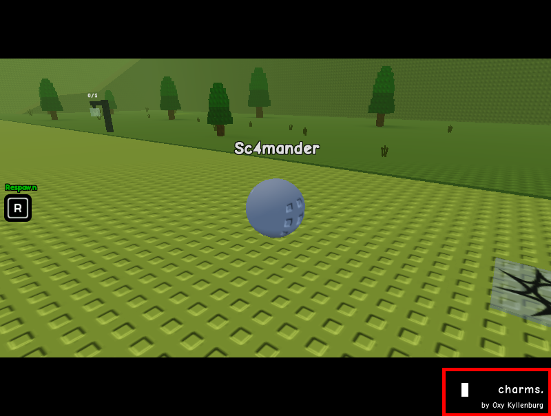
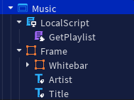
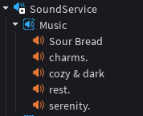

# Music Playlist Display

## Overview

A music playlist player for each world/biome, with a title and artist name visible
<br><br>

## Architecture
 
<br><br>

## Playlist Configuration
Inside the module ("GetPlaylist"), the playlist stored in a dictionary
```lua
local list = {
  ["Biome1"] = "Happy song", "Happy song2",
  ["Biome2"] = "Sad song", "Sad song2",
}
```
<br>

A function to return the requested playlist
```lua
return function(biomeName)
  return list[biomeName]
end
```
<br><br>

