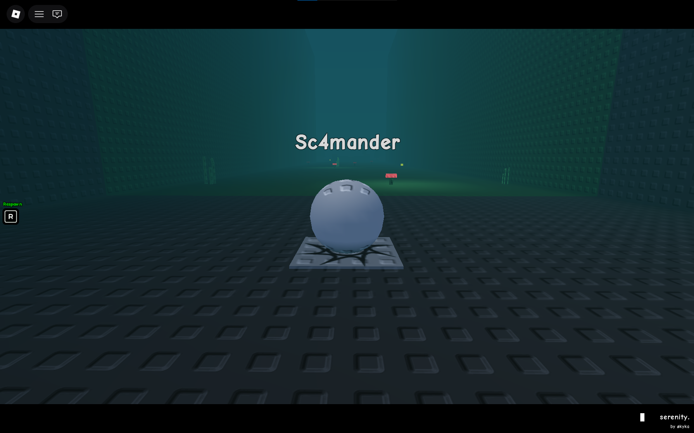
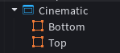
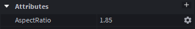

# Responsive Cinematic Aspect Ratio

<br><br>

## Architecture
  
<br><br>

## Implementation

### Calculating each bar height depends on the screen height
```lua
local screenSize = screenGui.AbsoluteSize
local gameplayHeight = screenSize.X / screenGui:GetAttribute("AspectRatio")
local barHeight = (screenSize.Y - gameplayHeight) / 2
```
<br>

### Apply the result to each bar
```lua
barTop.Size = UDim2.new(1, 0, 0 barHeight)
barBottom.Size = UDim2.new(1, 0, 0, barHeight)
```
<br>

### Making it responsive
```lua
screenGui:GetPropertyChangedSignal("AbsoluteSize"):Connect(function()

  local screenSize = screenGui.AbsoluteSize
  local gameplayHeight = screenSize.X / screenGui:GetAttribute("AspectRatio")
  local barHeight = (screenSize.Y - gameplayHeight) / 2

  barTop.Size = UDim2.new(1, 0, 0 barHeight)
  barBottom.Size = UDim2.new(1, 0, 0, barHeight)

end)
```
<br><br>

## Usage
```lua
local screenGui = script.Parent
local top = screenGui.Top
local bottom = screenGui.Bottom

-- Functions
local getBarYSize = function()
	
	local screenSize = screenGui.AbsoluteSize
	local gameplayHeight = screenSize.X / screenGui:GetAttribute("AspectRatio")
	
	return (screenSize.Y - gameplayHeight) / 2
	
end

local updateAspectRatio = function()
	
	local barYSize = getBarYSize()
	top.Size = UDim2.new(1, 0, 0, barYSize)
	bottom.Size = UDim2.new(1, 0, 0, barYSize)
	
end

---

updateAspectRatio()
screenGui:GetPropertyChangedSignal("AbsoluteSize"):Connect(function()
	
	local barYSize = getBarYSize()
	top.Size = UDim2.new(1, 0, 0, barYSize)
	bottom.Size = UDim2.new(1, 0, 0, barYSize)
	
end)
```
